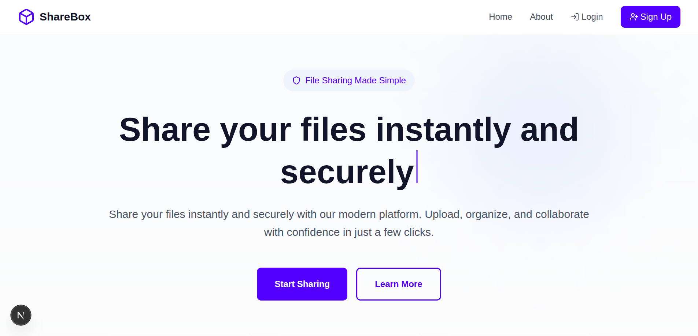
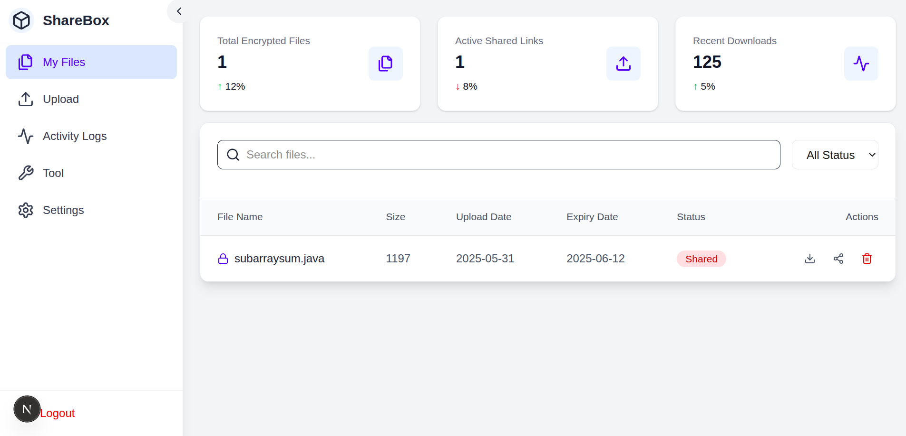
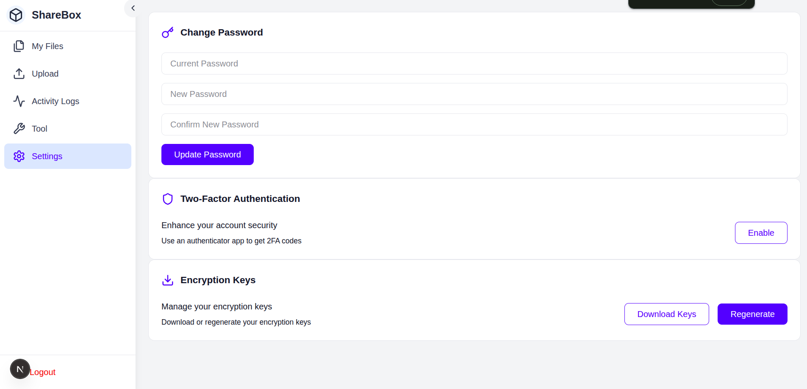

# ShareBox
## Overview
ShareBox is a secure file-sharing system designed to ensure the confidentiality and integrity of shared files. By leveraging AES-256 encryption, ShareBox provides a robust platform for secure file transfers. The system integrates a powerful backend with a modern frontend to deliver a seamless and secure user experience.

---

## Features
- **Frontend**:
    - Intuitive and responsive user interface.
    - File upload and download functionality with progress tracking.
    - User-friendly design for managing shared files.

- **Backend**:
    - AES-256 encryption for secure file storage and sharing.
    - RESTful API with comprehensive documentation using Swagger.
    - Secure authentication and authorization with Spring Security.
    - Integration with Cloudinary for file storage.

- **Additional Features**:
    - Role-based access control for enhanced security.
    - File sharing with unique, time-limited links.
    - Detailed activity logs for file access and sharing.

---

## Tech Stack
### Frontend
- Next.js
- Tailwind CSS
- Axios

### Backend
- Spring Boot
- MySQL
- Spring Security
- Swagger
- Cloudinary

---

## ScreenShot






---

## Demo
https://www.youtube.com/watch?v=_lgZyj-ytDU

---
## Installation

### Prerequisites
- Java 21 or higher
- Node.js (v14 or higher)
- npm (v6 or higher)
- MySQL (local or remote instance)

### Steps
1. Clone the repository:
    ```bash
    git clone https://github.com/ManishPatidar806/ShareBox.git
    ```
2. Navigate to the project directory:
    ```bash
    cd sharebox
    ```
3. Install dependencies for both frontend and backend:
    - Frontend:
        ```bash
        cd frontend
        npm install
        ```
    - Backend:
        ```bash
        cd backend
        ./mvnw install
        ```
4. Set up environment variables:
    - Backend: Create a `application.properties` file in the `src/main/resources` directory with necessary configurations (e.g., database credentials, Cloudinary API keys).
    - Frontend: Create a `.env.local` file in the `frontend` directory with required configurations.

5. Start the development servers:
    - Backend:
        ```bash
        cd backendx
        ./mvnw spring-boot:run
        ```
    - Frontend:
        ```bash
        cd frontend
        npm run dev
        ```

---

## Usage
1. Access the frontend at `http://localhost:3000`.
2. Register or log in to start securely sharing files.
3. Upload files, generate secure links, and manage shared files through the dashboard.

---


## License
This project is licensed under the MIT License. See the `LICENSE` file for more details.

---
